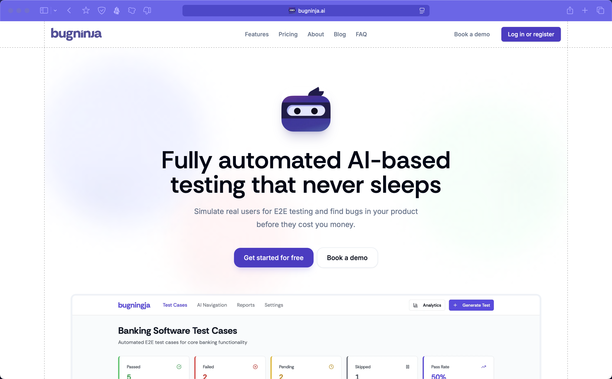

# Bugninja Landing

A landing page and content management system built with a modern Docker-based architecture, featuring a Next.js frontend, Strapi CMS, and PostgreSQL database.



## 🏗️ Architecture Overview

This project uses a **monorepo structure** with multiple containers orchestrated via Docker Compose:

### Container Services

| Container | Port | Purpose | Technology |
|-----------|------|---------|------------|
| **`landing`** | 3001 | Marketing/landing page | Next.js (TypeScript) |
| **`cms`** | 1337 | Content management system | Strapi |
| **`db`** | 5432 | PostgreSQL database | PostgreSQL 16 |

### Container Details

- **`landing`**: The main landing page application built with Next.js and TypeScript
- **`cms`**: Strapi headless CMS for content management with PostgreSQL backend
- **`db`**: PostgreSQL database serving multiple databases (webapp_skeleton, strapi)

## 📦 Project Structure

```
bugninja-landing/
├── packages/
│   ├── landing/       # Landing page application
│   └── shared-ui/     # Shared UI components
├── cms/               # Strapi CMS configuration
├── infrastructure/    # Docker configurations
├── scripts/          # Utility scripts
├── docker-compose.yml # Container orchestration
└── package.json      # Root workspace configuration
```

### Why Shared UI?

The `packages/shared-ui` folder contains reusable React components that can be used by the **landing** application and potentially future applications. This approach provides:

- **Code Reusability**: Common components (buttons, forms, layouts) are written once and used everywhere
- **Design Consistency**: Ensures consistent styling and behavior across all applications
- **Easier Maintenance**: Updates to shared components automatically apply to all consumers
- **Type Safety**: Shared TypeScript definitions ensure type consistency across packages
- **Faster Development**: Developers don't need to recreate similar components

## 🚀 Quick Start

### Prerequisites

- Docker & Docker Compose
- Node.js (for local development and linting)

### 1. Clone and Setup

```bash
git clone <repository-url>
cd bugninja-landing
```

### 2. Install Dependencies Locally

**Important**: You must install NPM packages locally even though the application runs in Docker containers. This is required for:

- **Linter Support**: Your IDE needs local packages to provide proper TypeScript/ESLint error detection
- **IntelliSense**: Autocomplete and type checking in your editor
- **Development Experience**: Proper syntax highlighting and error detection

```bash
# Install root dependencies
npm install

# Install dependencies for all workspaces
npm install --workspaces
```

### 3. Start All Services

```bash
# Start all containers
docker-compose up -d

# View logs
docker-compose logs -f

# Check container status
docker-compose ps
```

### 4. Access Applications

- **Landing Page**: http://localhost:3001
- **CMS Admin**: http://localhost:1337/admin
- **Database**: localhost:5432

## 🛠️ Development Commands

### Container Management

```bash
# Start all services
docker-compose up -d

# Stop all services
docker-compose down

# Restart specific service
docker-compose restart <service-name>

# View logs for specific service
docker-compose logs -f <service-name>

# Execute commands in running container
docker-compose exec <service-name> <command>

# Rebuild specific service
docker-compose build <service-name>
```

### Local Development Scripts

```bash
# Development (runs locally, not in containers)
npm run dev                  # Start landing page
npm run dev:landing          # Start landing page

# Building
npm run build               # Build landing page
npm run build:landing       # Build landing page

# Linting
npm run lint                # Lint landing page
npm run lint:landing        # Lint landing page

# Type Checking
npm run type-check          # Type check landing page
npm run type-check:landing  # Type check landing page
```

### Package Management

When installing new packages:

```bash
# 1. Install locally for linting/IDE support
npm install <package-name> --workspace=@bugninja/landing

# 2. Install in running container
docker-compose exec landing npm install <package-name>

# 3. If adding new dependencies, rebuild the container
docker-compose build landing
docker-compose up -d landing
```

### Database Operations

```bash
# Access PostgreSQL
docker-compose exec db psql -U postgres -d <database-name>

# Available databases: webapp_skeleton, strapi

# Backup database
docker-compose exec db pg_dump -U postgres <database-name> > backup.sql

# Restore database
docker-compose exec -T db psql -U postgres <database-name> < backup.sql
```

## 🔧 Development Workflow

### Making Code Changes

Since the containers run in development mode with volume mounting:

1. **Edit code locally** - Changes are automatically reflected in containers
2. **Hot reload** - The Next.js landing page supports hot reloading
3. **No restart needed** - Unless you're adding new dependencies or changing Docker configuration

### When to Restart Containers

- Adding new NPM packages
- Changing environment variables
- Modifying Docker configuration
- Database schema changes (CMS)

### Adding New Dependencies

```bash
# Example: Adding a new package to the landing page
npm install react-query --workspace=@bugninja/landing
docker-compose exec landing npm install react-query
docker-compose restart landing
```

## 🐛 Troubleshooting

### Common Issues

1. **Linter errors but app works**: Ensure local packages are installed
2. **Database connection issues**: Check if `db` container is healthy
3. **Port conflicts**: Ensure ports 3001, 1337, 5432 are available
4. **Cache issues**: Try `docker-compose down -v` to remove volumes

### Debug Commands

```bash
# Check container health
docker-compose ps

# View detailed logs
docker-compose logs -f <service-name>

# Inspect container
docker-compose exec <service-name> sh

# Check network connectivity
docker-compose exec landing ping db
```

## 📝 Environment Variables

Key environment variables are set in `docker-compose.yml`. For production deployment, create a `.env` file with:

```env
DATABASE_URL=postgresql://postgres:postgres@db:5432/webapp_skeleton
ADMIN_JWT_SECRET=your-secure-secret
STRAPI_JWT_SECRET=your-secure-secret
STRAPI_APP_KEYS=your-secure-app-keys
API_TOKEN_SALT=your-secure-api-token-salt
TRANSFER_TOKEN_SALT=your-secure-transfer-token-salt
```

## 🚀 Production Deployment

For production deployment:

1. Update environment variables in `docker-compose.prod.yml`
2. Build production images: `docker-compose -f docker-compose.prod.yml build`
3. Deploy: `docker-compose -f docker-compose.prod.yml up -d`

## 📚 Additional Resources

- [Next.js Documentation](https://nextjs.org/docs)
- [Strapi Documentation](https://docs.strapi.io/)
- [Docker Compose Documentation](https://docs.docker.com/compose/) 